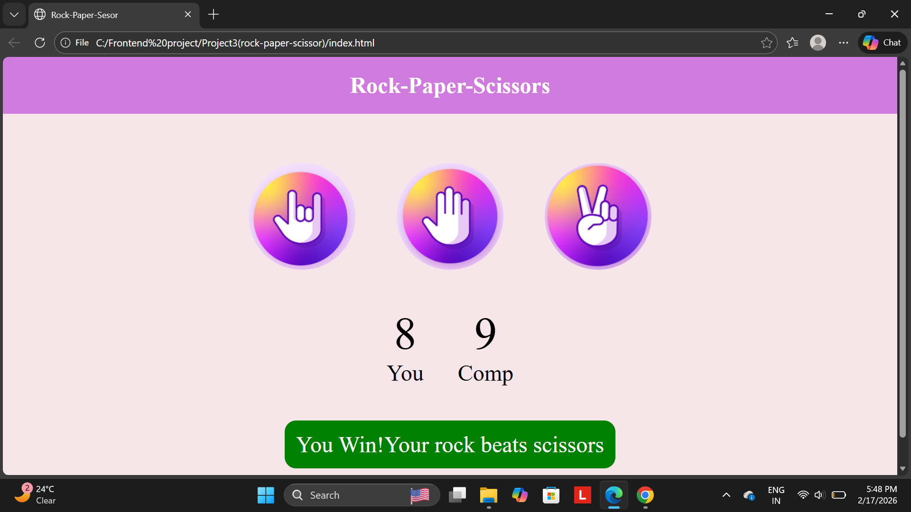

🎮 Rock Paper Scissors Game
📝 Description
This project is a simple Rock Paper Scissors game where a user plays against the computer. The computer randomly selects Rock, Paper, or Scissors, and the winner is decided based on standard game rules. This project helps beginners understand basic programming logic and user interaction.

✨ Features
User vs Computer gameplay
Random computer choice generation
Displays winner after each round
Simple and easy-to-understand program
Option to play multiple rounds

🕹️ Game Rules
🪨 Rock beats Scissors
✂️ Scissors beats Paper
📄 Paper beats Rock
If both choices are the same, the result is a draw

💻 Technologies Used
Programming Language: HTML/CSS/JS
Compiler/IDE: VS Code

🚀 How to Run the Project
Clone or download this repository
Open the project in your preferred compiler or IDE
Run the program
Enter your choice when prompted
View the result and play again

